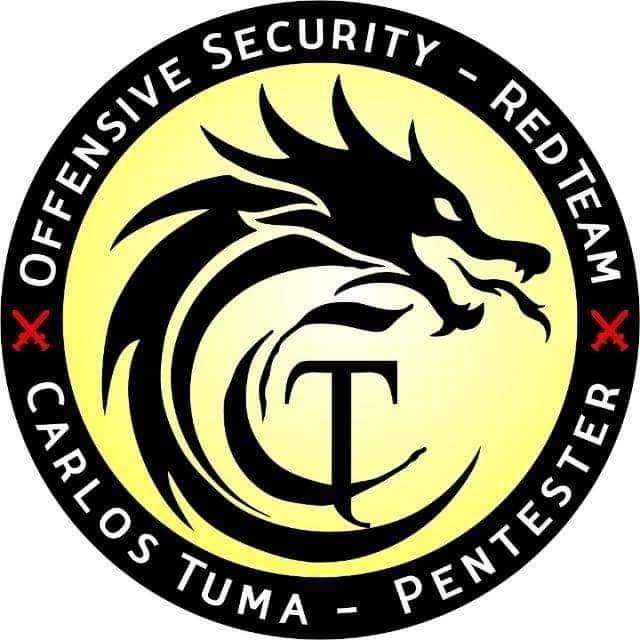

# Bl4dHunt3r V.0.3
 Tool for Pentester & BugHunter

<!---Esses são exemplos. Veja https://shields.io para outras pessoas ou para personalizar este conjunto de escudos. Você pode querer incluir dependências, status do projeto e informações de licença aqui--->


<!---


> Projeto criado para reconhecimento e ataque automatizado, a ferramenta é voltada por Pentester, BugHunter e entusiasta em Ethical Hacking, a ferramenta utiliza  algumas tools que não são de minha autoria, não faça teste em dominio sem permissão, não me responsabilizo pelo mau uso da ferramenta, toda e qualquer utilização para o crime é de inteira responsabilidade de quem utiliza.

### Ajustes e melhorias

O projeto ainda está em desenvolvimento e as próximas atualizações serão voltadas nas seguintes tarefas:

- [ ] Desempenho
- [ ] Melhorias de Recon 
- [ ] Ataque Automatizado
- [ ] Reconhecimento de InfraEstrutura


## 💻 Pré-requisitos

Antes de começar, verifique se você atendeu aos seguintes requisitos:

* Subfinder `https://github.com/projectdiscovery/subfinder`
* Findomain `https://github.com/Findomain/Findomain`
* Httpx `https://github.com/projectdiscovery/httpx`
* Fdupes `https://github.com/adrianlopezroche/fdupes` pode ser instalado >>> sudo apt-get install fdupes
* Qsreplace `https://github.com/tomnomnom/qsreplace`
* Retire Js `https://github.com/retirejs/retire.js/`
* Wappalyzer-cli `https://github.com/gokulapap/wappalyzer-cli`
* Uro `https://github.com/s0md3v/uro`
* Notify `https://github.com/projectdiscovery/notify`

## 🚀 Testado Kali Linux:

## ☕ Usando <Bl4dH4nt3r>

Para usar Bl4dHunt3r, siga estas etapas:

```
Instale primeiro os pré requisitos.
baixe o script e der permissão de execução: sudo chmod +x bl4dhunt3r.sh
Ps. execute como root
 
##############################################
# Use: ./bl4dhunt3r dominio.com U N N        #
#      ./bl4dhunt3r dominio C S S            #
#                                            #
#                                            #
# Opcoes : dominio.com U N N                 #
#          dominio C N N                     #
#                                            #
#          U  = dominio Unico                #
#          S  = Sub dominios                 #
#          SS = Sub/Sub dominios             #
#          C  = ProjectChaos                 #
#                                            #
#          S ou N = Verificar tecnologias    #
#          S ou N = verifiar WordPress       #
#                                            #
# Obs: ProjectChaos "C" dominio sem o final  #
# nome composto separar _                    #
##############################################
  
```

## 🤝 Colaboradores

Agradecemos às seguintes pessoas que contribuíram para este projeto:

<table>
  <tr>
    <td align="center">
      <a href="#">
        <br>
        <sub>
          <b>Carlos Tuma - Bl4dSc4n</b>
        </sub>
      </a>
    </td>
    <td align="center">
  </tr>
</table>


## 📝 Licença

Esse projeto é de livre uso e modificação, favor manter os créditos em comentário.
 
Ps. não utilize para crimes ciberneticos, não tenho responsábilidade do mau uso da ferramenta.

[⬆ Voltar ao topo](#nome-do-projeto)<br>
